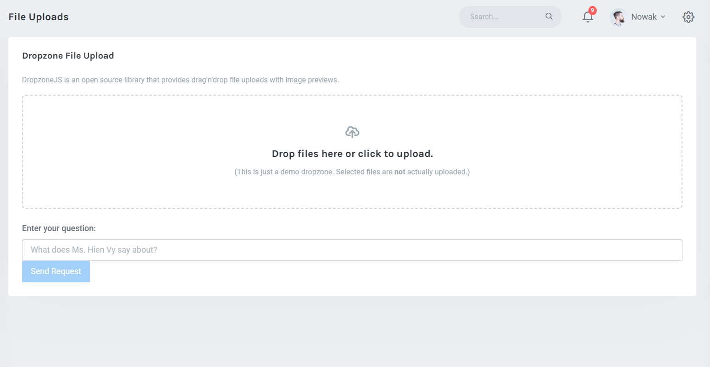

# Azure-OpenAI

## To do
- [x] Upload file PDF
- [ ] Loading / exporting a conversation
- [ ] Speech output and input
- [ ] Link output and input
 
# Azure OpenAI



## Getting Started
To get started with this project, you'll need to clone the repository and set up a virtual environment. This will allow you to install the required dependencies without affecting your system-wide Python installation.

### Prequisites
Before you can set up a virtual environment, you'll need to have Python installed on your system. You can download Python from the official website: https://www.python.org/downloads/

### Cloning the Repository
Run the following command to clone the repository:
```
git clone https://github.com/khoanguyen23/Azure-OpenAI-.git
```

### Setting up a Virtual Environment
To set up a virtual environment, follow these steps:

1. Navigate to the root directory of your project.
```
cd model
```
2. Install the required dependencies by running the following command:
```
pip install -r requirements.txt
```
3. Run the application:
```
python app.py
```

### Running the Application
To run the application, make sure the virtual environment is active and run the following command:

1. Navigate to the root directory of your project.
```
cd client
```
2. Start my application:
```
npm start
```

### Configure the Application
To configure the application, there are a few properties that can be set either via the environment or via config.json.  The environment variable takes priority.

| Field                   | Env Variable    | examples                                           |
|-------------------------|-----------------|----------------------------------------------------|
| The OpenAI Api Key      | OPENAI_API_KEY  | b1...                                             
| The OpenAI endpoint URL | OPENAI_API_BASE | http://my-reverse-proxy/ 

Use the Base URL if you need to run your queries through a reverse proxy (like [this one](https://github.com/stulzq/azure-openai-proxy) which will run your queries through Azure's OpenAI endpoints )